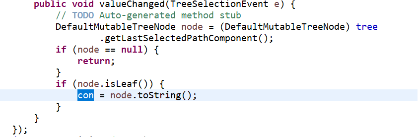

# dsa_project
### Project implementation and code analysis

I. Basic data processing
1. Read the json file, which shows that xx poems and xx authors have been read, including xx poets from the Tang Dynasty and xx poems, xx poets from the Song Dynasty and xx poems, etc.
The text in json format is read character by character through a loop, and the author, title and content are separated during reading and stored in the map. ArrayList is used to connect poems. There are 313 json files in total. Two authors introduce json files. ArrayList is also used to connect the files. ArrayList<ArrayList<Map>> is obtained. The poems read in are counted and exported to txt. (i.e. ReadIn.java file)
2. Provide query for an author and display list query results of all his poems
3. Query a certain keyword and display the query result list
4. Multi-keyword combination query, display query result list
5. Enter the txt file to query and display the query statistical results (enter the txt file to customize, please refer to poem75.txt)

II. tag classification function
1. Display the details of a poem and its tag content (can be empty)
2. Add or delete a tag of a poem
3. Query the keyword function of a certain tag
4. Create tags for multiple poems in batches from given txt files
              
III． Learning process simulation
1. Display the list of all poems in the learning simulation (title and author), no less than 100 poems
2.1 Specify, select from query results such as title, author, content, etc.
2.2 Random, must not appear as having learned (100% proficiency) or currently learning (0<proficiency<100%)
2.3 According to the recommended list in the learned poem tag, you should not recommend only one poem
3. Review, display the poems to be reviewed, and display the proficiency of each poem
4. Feedback on new proficiency after learning
Each time you click on the learning results display in the main menu, use jtree to create a tree based on user.studylist (the method private void set Appearance() in ResultFrame is the tree building method) with the user name root, which is divided into a learning list, a review list, and an unlearned list. , proficiency list and recommendation list, the proficiency level is changed every time you learn a new poem, and the proficiency level is classified into the corresponding branches and displayed. Each time this window is opened, the list is re-read and the tree is created.
Whenever the mouse clicks on a poem (leaf), the node.tostring is obtained through monitoring and stored in a global variable. When you click "View the poem" again, it will jump to the learning page of the poem. If you click on non-leaf or "None", then click "View the poem" and there will be no response. If you click on multiple poems, the learning interface of the last clicked poem will be opened.

5.1 Support multi-user learning process simulation
5.2 Analysis and comparison of multi-user learning results
When the user name: guanliyuan and password 123456 are entered in the login window, the administrator window pops up. First, read each folder name in the User folder to obtain the names of all users, and read the studylist in each folder through a loop. .txt poem, and create a tree based on proficiency (Map key is 4). With the administrator as the root, add the subtree of each username to the root. The tree building method is similar to ResultFrame, with an additional loop.

IV. Display and analysis of learning results
1. Tree structure or network structure can be used to display the relationship between the poems studied, and it is reasonable and meaningful.
After the learning results display interface is opened, use jtree to create a tree. The root is the user name. The sub-branches of root are the learning list and the recommended list. The learning list is divided into what you learned today, review list, unlearned list and proficiency list. You have complete mastery of what you learned today. , basic mastery, weak mastery and failure to learn. The review list is divided into three rounds of review and non-review. The branches under the list are poems.

V． Overall display effect
GUI display operation:
1. Poetry list, detail display, tag processing, etc.
2. The query and query results are displayed reasonably
3. Display the poems the user learns every day, including the user’s choice to learn new poems every day
You can view it under the branch you learned today in the learning results display. The code explanation is the same as III.4 and IV.1.
4. User feedback learning operation
5. Analysis and display of learning results
The view is obtained through the tree of learning results display or the view analysis under this window. The view analysis will generate two pie charts through jfreechart (the code for generating pie charts is as follows), and the pie chart data is obtained according to the loop studylist (public int[] getdata() method to get data)
Show the current learning and mastery status, and give today's evaluation based on the number of poems with different mastery levels of the poems learned that day. If the numbers are equal, the one with the lower level will prevail.
6. Save the learning results as a text file and make it clear and reasonable according to the file structure.
The export button of the learning results display can generate result.txt in the src menu at the same level, and write it into txt according to the tree format. That is, the studylist is looped into different ArrayLists according to the learning level, and then the ArrayList is printed. Each time you click to export the file A new label "Export Successful" is added to the back window.
